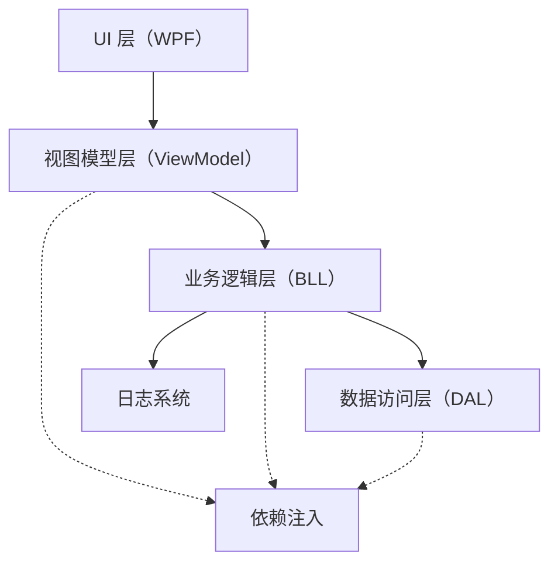
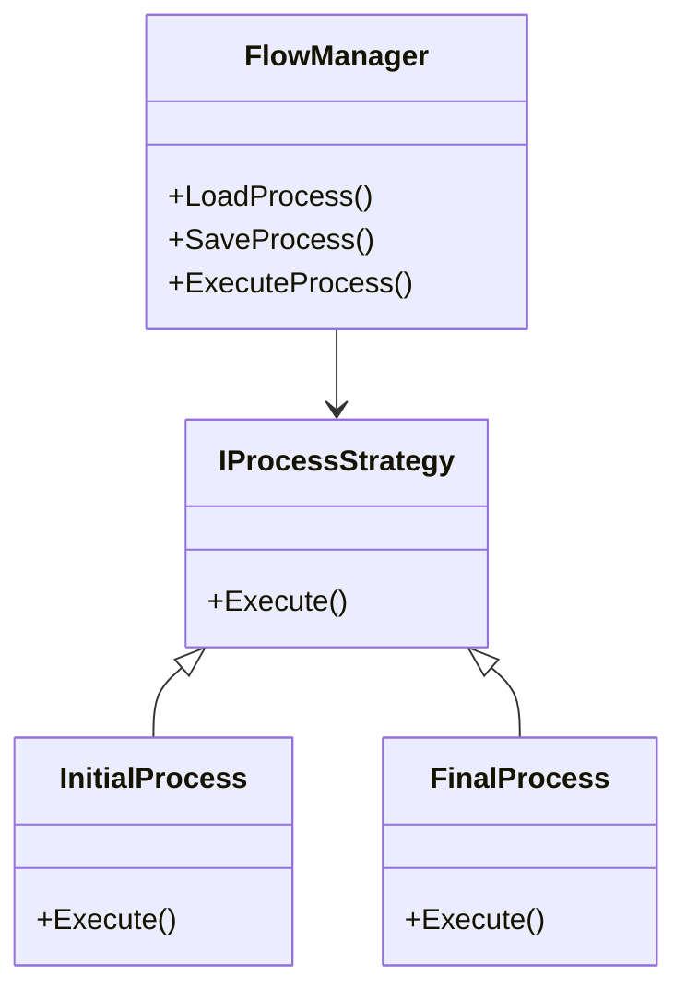
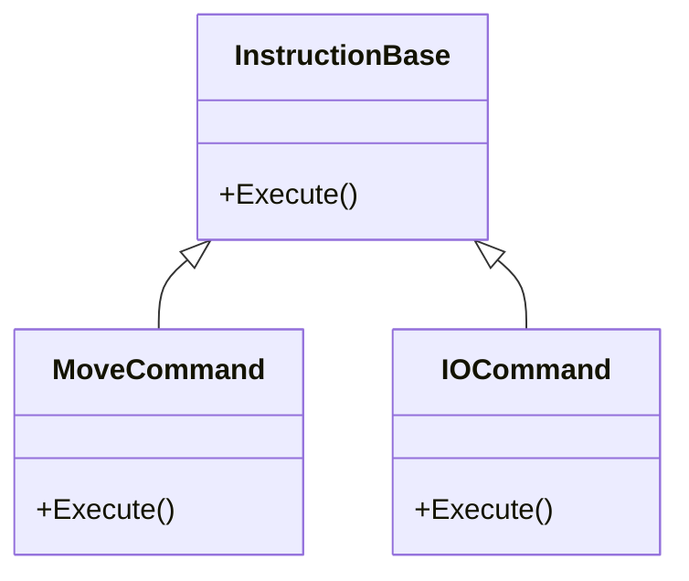
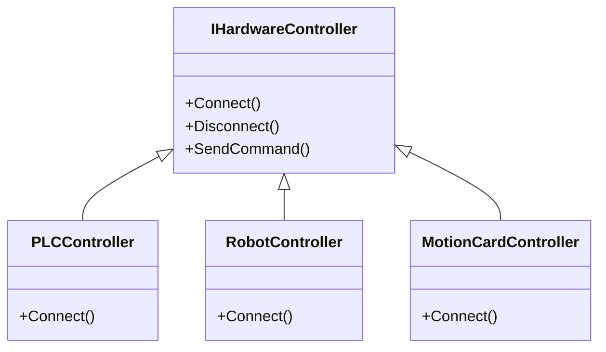
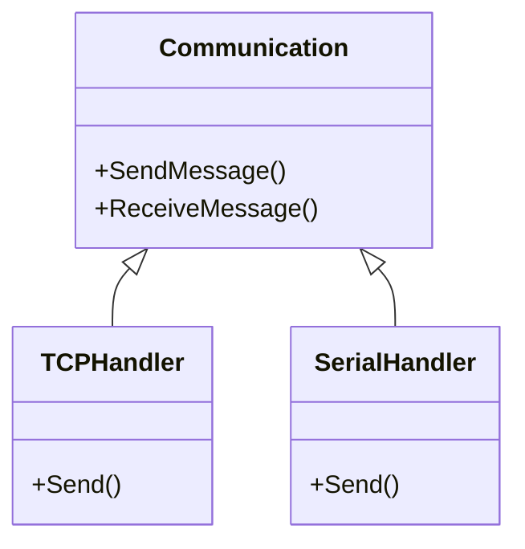

# 平台重构项目文档

## 开发文档

### 需求分析

#### 1. 明确重构目标 {id="refactor-goals"}
为了使我们更清晰地规划重构工作，请回答以下问题：
- **核心代码重构目标：**
    - 代码可维护性、性能优化、模块化设计、提高测试覆盖率。
    - 重点重构对象:
      - 流程管理模块的存储,导入
      - 指令模块的扩展性

- **UI移植目标：** 
    - 增强用户体验、更灵活的布局、引入现代UI控件。
    - 解耦UI和业务逻辑，使得UI更易于维护和扩展。

#### 2. 评估现有代码 {id="current-code"}
- **系统架构**：目前是单项目架构,无数据库系统,业务逻辑和UI耦合度高。
- **核心模块**：程序中的主要模块有,流程管理模块指令模块、工站管理、硬件资源管理模块、通讯模块、数据管理模块(应用内变量,以及数据结构体)。
- **代码质量**：代码耦合度高、缺乏单元测试、缺乏文档、业务扩展难、没有设计模式的引用。

#### 3. 其他需求 {id="other-requirements"}
- **技术栈**：依赖注入框架、日志记录等
- **版本控制**：使用Git进行版本控制

### 第二步：系统设计

#### 1. 分层架构设计 {id="layered-architecture"}
为了实现低耦合度和高可维护性，我们建议使用分层架构，将系统划分为不同层次。以下是我们为重构项目建议的分层设计：

1. **UI层（WPF）**
    - **功能**：用于处理用户交互。使用WPF的XAML文件进行界面设计，数据绑定通过MVVM（Model-View-ViewModel）模式来实现，以实现视图与业务逻辑的完全解耦。
    - **技术**：WPF + MVVM模式。采用命令绑定和数据绑定来减少代码与UI的耦合。

2. **视图模型层（ViewModel）**
    - **功能**：作为UI层与业务逻辑之间的桥梁。ViewModel包含命令和属性，负责处理用户交互事件和数据绑定。
    - **设计建议**：为每个主要的界面部分创建单独的ViewModel，保持职责单一。

3. **业务逻辑层（BLL，Business Logic Layer）**
    - **功能**：负责处理系统的业务逻辑。这个层次可以实现核心模块的逻辑，如流程管理、指令管理、数据管理等。
    - **设计模式**：为了提高代码的可维护性和扩展性，可以在这个层中使用策略模式、工厂模式等设计模式来实现不同的功能。

4. **数据访问层（DAL，Data Access Layer）**
    - **功能**：虽然目前没有数据库，但可以创建一个抽象的数据访问层来管理数据存取（例如文件存取、配置管理等）。
    - **未来扩展**：这使得以后加入数据库等数据存储解决方案变得更加容易。

5. **依赖注入**
    - **使用建议**：在业务逻辑层与数据访问层之间，可以使用依赖注入框架（如`Microsoft.Extensions.DependencyInjection`）来进行依赖关系的管理，以便更好地进行模块化设计，增强测试性。

6. **日志系统**
    - **使用建议**：加入日志记录功能，使用`NLog` 日志框架，用于捕获系统运行过程中的错误和重要信息，便于后期的维护和排查。

#### 2. 核心模块的重新设计 {id="core-modules"}
针对现有系统的核心模块，以下是对每个模块的建议设计：

1. **流程管理模块**
    - **重构目标**：将数据存储逻辑与流程管理逻辑分离。
    - **设计思路**：通过数据访问层进行流程存储和导入的实现，将不同的流程操作使用策略模式或状态模式进行管理。

2. **指令模块**
    - **扩展性需求**：为了提高指令的扩展性，可以通过使用命令模式，将不同类型的指令封装为独立的类。
    - **设计思路**：创建指令基类并通过继承来扩展不同类型的指令，同时通过工厂模式来实现指令的实例化，以便动态添加新指令。

3. **硬件资源管理模块**
    - **重构目标**：减少对具体硬件类型的依赖，通过定义接口来与硬件通信。
    - **设计思路**：使用接口和适配器模式，以便在需要时支持更多不同种类的硬件设备。

4. **通讯模块**
    - **建议设计**：使用事件驱动模型处理消息通信，并将通讯协议的处理逻辑抽象出来以便于扩展不同的通讯协议。

5. **数据管理模块**
    - **目标**：更好地管理应用内变量和数据结构体。
    - **设计建议**：使用单例模式来管理全局的数据缓存，或者通过观察者模式监听不同数据的变化，确保数据状态的同步。

#### 3. 类和模块图的创建 {id="class-diagrams"}
- 我建议使用UML工具（例如`PlantUML`或`Lucidchart`）来绘制类图和模块图，以帮助更好地进行系统设计和规划。这将使我们明确类的职责以及它们之间的关系，有助于降低耦合度。

# 平台重构项目 - 类与模块设计图草稿

## 1. 分层架构模块图
### 1.1 分层架构概述
以下为系统分层架构的模块图，主要包括 UI 层、视图模型层、业务逻辑层、数据访问层、依赖注入和日志系统模块。每个模块的职责和作用如下：

- **UI 层（WPF）**：用户交互的主要界面，使用 XAML 文件进行布局和交互设计。
- **视图模型层（ViewModel）**：负责与 UI 层进行数据绑定，并提供命令来处理用户交互。
- **业务逻辑层（BLL）**：处理系统的核心逻辑，将具体功能模块化。
- **数据访问层（DAL）**：抽象数据的存取方式，当前是文件存储，未来可以扩展为数据库存取。
- **依赖注入**：管理模块之间的依赖关系，以实现低耦合度和高可测试性。
- **日志系统**：捕获系统运行时的关键日志信息，方便调试与排查问题。

## 2. 核心模块类图
### 2.1 流程管理模块

- **FlowManager**：负责流程的加载、保存和执行。
- **IProcessStrategy**：定义不同流程类型的通用接口，通过策略模式实现不同类型的流程。
- **InitialProcess** & **FinalProcess**：实现了不同流程的具体行为。

### 2.2 指令模块类图

- **InstructionBase**：所有指令的基类，定义指令的基本行为。
- **MoveCommand** & **IOCommand**：不同类型的指令，通过继承实现指令的具体逻辑。

### 2.3 硬件资源管理模块类图

- **IHardwareController**：抽象硬件控制器接口，定义所有硬件设备通用的方法。
- **PLCController** & **RobotController** & **MotionCardController**：实现了具体硬件控制的行为，如 PLC 和机器人 和 运动控制卡。

## 3. 通讯模块类图
### 3.1 通讯模块设计

- **Communication**：负责所有通讯逻辑的统一接口。
- **TCPHandler** & **SerialHandler**：分别实现了 TCP 通讯和串口通讯的具体逻辑。

